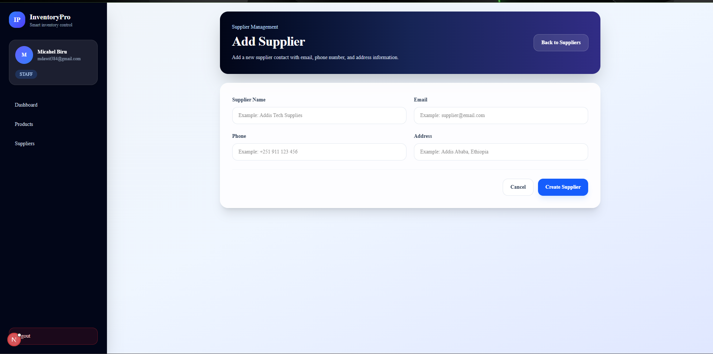
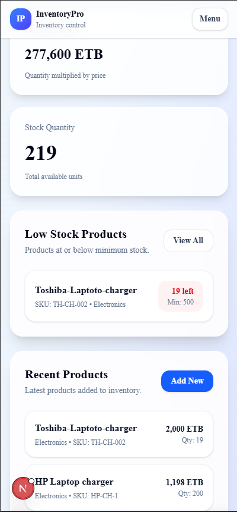

# InventoryPro

InventoryPro is a full-stack inventory management web application built for small businesses to manage products, suppliers, stock levels, and inventory value.

The system includes authentication, user-specific data, product management, supplier management, dashboard analytics, search, filtering, low-stock tracking, and a responsive modern admin interface.

## Features

- User registration and login
- JWT-based authentication
- Protected dashboard routes
- User-specific products and suppliers
- Product CRUD operations
- Supplier CRUD operations
- Product search by name, SKU, and category
- Product stock filtering
- Supplier search by name, email, phone, and address
- Dashboard analytics
- Low-stock product tracking
- Total inventory value calculation
- Modern responsive dashboard UI
- Desktop sidebar navigation
- Mobile navigation menu
- Mobile-friendly product and supplier cards
- Logout functionality

## Tech Stack

### Frontend

- Next.js
- React
- TypeScript
- Tailwind CSS
- ShadCN UI
- Axios

### Backend

- Node.js
- Express.js
- TypeScript
- Prisma ORM
- PostgreSQL
- Supabase
- JWT
- bcryptjs

## Project Structure

```txt
inventorypro/
├── backend/
│   ├── prisma/
│   ├── src/
│   │   ├── config/
│   │   ├── controllers/
│   │   ├── middleware/
│   │   ├── routes/
│   │   └── server.ts
│   └── package.json
│
├── frontend/
│   ├── app/
│   │   ├── dashboard/
│   │   ├── login/
│   │   ├── products/
│   │   ├── register/
│   │   └── suppliers/
│   ├── components/
│   ├── lib/
│   └── package.json
│
├── screenshots/
└── README.md
```

## Main Pages

- Register page
- Login page
- Dashboard page
- Products page
- Create product page
- Edit product page
- Suppliers page
- Create supplier page
- Edit supplier page

## API Routes

### Auth

```txt
POST /api/auth/register
POST /api/auth/login
```

### Dashboard

```txt
GET /api/dashboard/stats
```

### Products

```txt
GET /api/products
POST /api/products
GET /api/products/:id
PATCH /api/products/:id
DELETE /api/products/:id
```

### Suppliers

```txt
GET /api/suppliers
POST /api/suppliers
GET /api/suppliers/:id
PATCH /api/suppliers/:id
DELETE /api/suppliers/:id
```

## Environment Variables

Create a `.env` file inside the `backend` folder.

```env
DATABASE_URL="your_supabase_postgresql_connection_string"
JWT_SECRET="your_jwt_secret"
PORT=5000
```

Do not commit your real `.env` file to GitHub.

## How to Run Locally

### 1. Clone the repository

```bash
git clone https://github.com/mzg-arch/InventoryPro.git
cd InventoryPro
```

### 2. Run the backend

```bash
cd backend
npm install
npx prisma generate
npx prisma migrate dev
npm run dev
```

The backend runs on:

```txt
http://localhost:5000
```

### 3. Run the frontend

Open a new terminal:

```bash
cd frontend
npm install
npm run dev
```

The frontend runs on:

```txt
http://localhost:3000
```

## Build Test

### Frontend build

```bash
cd frontend
npm run build
```

### Backend build

```bash
cd backend
npm run build
```

Both frontend and backend production builds have been tested successfully.

## Database Models

The main database models are:

- User
- Product
- Supplier

Each user has their own products and suppliers, so inventory data is separated between accounts.

## Screenshots

### Login Page


### Register Page


### Dashboard Page


### Products Page


### Create Product Page


### Suppliers Page


### Add Suppliers Page


### Mobile Dashboard


### Mobile Dashboard2


## Future Improvements

- Product image upload
- Export inventory to CSV
- Supplier-product assignment from the frontend
- Role-based admin permissions
- Pagination
- Deployment to Vercel and Render

## Author

Built by Micahel Biru.
